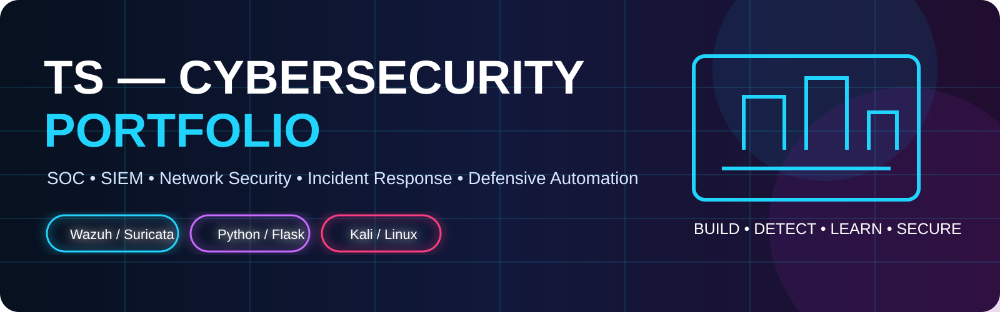
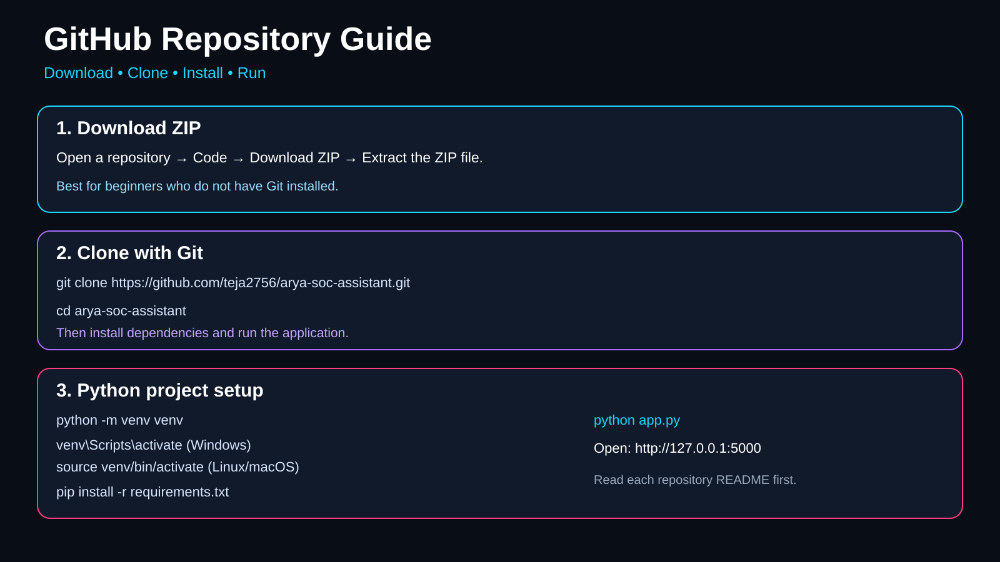

# ARYA SOC Assistant

**AI-assisted Security Operations Center (SOC) portfolio project by Ts.**

ARYA is designed around defensive security workflows such as alert triage, risk scoring, incident analysis, reporting and SOC-tool integration.



## 🔗 My GitHub Repositories

| Repository | Purpose | Visibility |
|---|---|---|
| [cyber](https://github.com/teja2756/cyber) | Collection of cybersecurity/SOC projects | Public |
| [arya-soc-assistant](https://github.com/teja2756/arya-soc-assistant) | ARYA AI SOC Assistant + portfolio documentation | Public |
| [new](https://github.com/teja2756/new) | Secure PII Storage & Dynamic Masking System | Public |

### Main cybersecurity projects in `cyber`

1. **Wazuh SOC Monitoring Lab**
2. **Suricata Real-Time Network IDS**
3. **Secure File Transfer — FTPS & Steganography**
4. **SOC Incident Response & Risk Scoring**
5. **Brute Force Detection — MITRE ATT&CK T1110**

## 📥 How to download any repository

### Method 1 — Download ZIP (easiest)

1. Open the repository on GitHub.
2. Click the green **Code** button.
3. Select **Download ZIP**.
4. Extract the ZIP on your computer.
5. Open the extracted project folder.
6. Read that project's `README.md` before running anything.

Example:

**ARYA:** https://github.com/teja2756/arya-soc-assistant

**Cyber projects:** https://github.com/teja2756/cyber

**PII project:** https://github.com/teja2756/new

> Downloading a ZIP gives you the current repository files. It does not install Python, Git, or project dependencies automatically.

## 🧰 Method 2 — Clone with Git

Install Git first, then open **Command Prompt / PowerShell / Git Bash** on Windows or **Terminal** on Linux/macOS.

### ARYA

```bash
git clone https://github.com/teja2756/arya-soc-assistant.git
cd arya-soc-assistant
```

### Cybersecurity projects

```bash
git clone https://github.com/teja2756/cyber.git
cd cyber
```

### PII masking project

```bash
git clone https://github.com/teja2756/new.git
cd new
```

To update an already-cloned repository later:

```bash
git pull
```

## 🐍 Python setup

For Python projects, Python **3.8+** is recommended unless the individual project README specifies otherwise.

Create a virtual environment:

### Windows

```bash
python -m venv venv
venv\\Scripts\\activate
```

If `python` is not recognized, try:

```bash
py -m venv venv
venv\\Scripts\\activate
```

### Linux/macOS

```bash
python3 -m venv venv
source venv/bin/activate
```

Install dependencies:

```bash
pip install -r requirements.txt
```

## ▶️ Run ARYA

From the `arya-soc-assistant` folder:

```bash
python app.py
```

Then open:

```
http://127.0.0.1:5000
```

Stop the Flask server with **Ctrl+C**.

## 🔐 PII Masking Project

Repository:

https://github.com/teja2756/new

The project demonstrates:

- MFA/TOTP
- Role-based access concepts
- AES-256-GCM encryption
- SHA-256 integrity
- PII detection
- Dynamic masking
- Audit logging
- SQLite storage

Before running it, read its README and `.env.example`. **Never put real API keys, passwords, tokens or personal data into GitHub.**

## 🛡️ Cybersecurity Projects

Repository:

https://github.com/teja2756/cyber

Each project has its own folder and README. Open the individual folder and follow its project-specific setup instructions.

The projects cover:

- Wazuh SIEM / SOC monitoring
- Suricata IDS
- Network security
- FTPS and steganography
- Incident response
- Risk scoring
- Brute-force detection
- MITRE ATT&CK T1110

## 🧪 Security Lab Tools

The documented portfolio uses or discusses:

- Wazuh
- Suricata
- Wireshark
- Nmap
- Metasploit
- Kali Linux
- VirtualBox
- VirusTotal
- Steghide
- ExifTool
- Binwalk
- Foremost

Use security tools only in systems and networks where you have permission to test.

## 📁 ARYA project structure

```
arya-soc-assistant/
├── app.py
├── soc_engine.py
├── requirements.txt
├── README.md
├── templates/
│   └── index.html
├── docs/
│   ├── project-notes.md
│   └── portfolio.md
└── assets/
    ├── portfolio-banner.svg
    └── repository-guide.svg
```

## 🖼️ Portfolio documentation

- [Portfolio information](docs/portfolio.md)
- [ARYA project notes](docs/project-notes.md)
- [Portfolio banner](assets/portfolio-banner.svg)
- [Repository download/setup guide](assets/repository-guide.svg)

## 👤 Portfolio links

- **LinkedIn:** https://www.linkedin.com/in/tejas-m-768295277
- **GitHub:** https://github.com/teja2756

## 🧯 Common troubleshooting

### `pip install -r requirements.txt` fails

Make sure the virtual environment is activated and upgrade pip:

```bash
python -m pip install --upgrade pip
pip install -r requirements.txt
```

### `python` is not recognized on Windows

Try:

```bash
py --version
```

If that works, use `py` instead of `python`.

### Port 5000 is already in use

Stop the other Flask/Python process or change the port in the application.

### Git is not recognized

Install Git and reopen your terminal. Then verify:

```bash
git --version
```

## ⚠️ Portfolio integrity note

Some files in these repositories are **reconstructed portfolio implementations based on Ts's supplied project notes/specifications**. They are intentionally labelled that way and should not be presented as original source-code archives unless the original source code is added separately.

## 📌 Recommended order for recruiters

Start with:

1. **Wazuh SOC Monitoring Lab**
2. **Suricata Real-Time Network IDS**
3. **ARYA SOC Assistant**
4. **SOC Incident Response & Risk Scoring**
5. **Brute Force Detection — MITRE ATT&CK T1110**
6. **Secure PII Storage & Dynamic Masking**

---

**Build • Detect • Learn • Secure**
